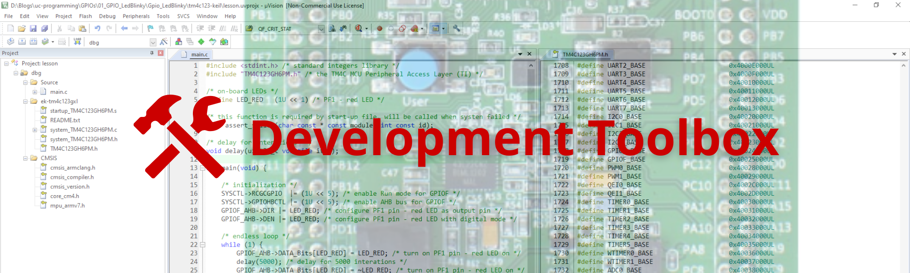

# Jet Station 🚀

# Menu

🏠 [Home](https://jet-station.github.io/) | 
🚀 [Embedded Systems](https://jet-station.github.io/embedded-systems/) |
🧰 [Development Toolbox](https://jet-station.github.io/development-toolbox/) |
🎓 [Training Courses](https://jet-station.github.io/training-courses/) |
📚 [Documents](https://jet-station.github.io/docs/)

# Development Toolbox

🎯 The Development Toolbox is your gateway to essential resources for embedded systems projects. Here you'll find information on a wide range of development boards and tools that help you design, build, and debug embedded applications. Whether you're choosing hardware or setting up your software environment, this section provides practical guidance and recommendations to accelerate your development journey.

<!-- Images Placeholder -->

<!-- Add more images as needed -->

## Development Boards
🔨 [Development Boards](https://jet-station.github.io/development-toolbox/boards/)
## Development Tools
🔧 [Development Tools](https://jet-station.github.io/development-toolbox/tools/)

# Repositories
🚀 [My Repositories](https://github.com/jet-station)

# Contact & Discussion
If you have any thing would like to discuss or cooperate with me, please don't hesitate to contact me via:
- 📧 Email [Ho Thien Ai](mailto:thienaiho95@gmail.com)
- 💼 LinkedIn [Thien Ai Ho](https://www.linkedin.com/in/thien-ai-ho/)

# Home Page
🏠 [Home](https://jet-station.github.io/)