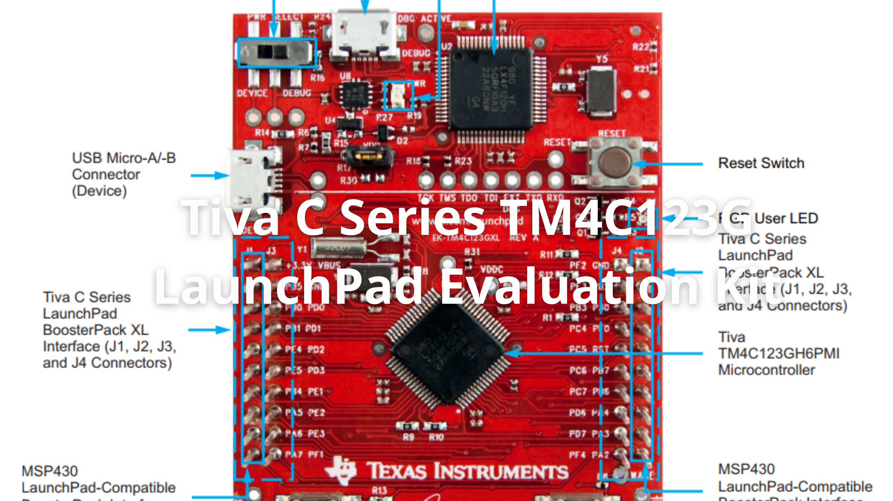
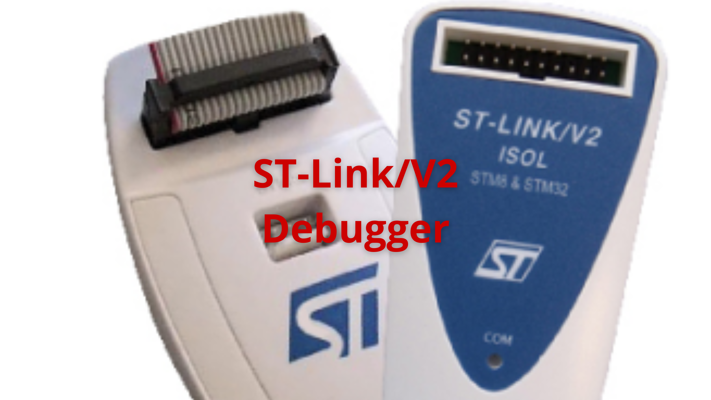
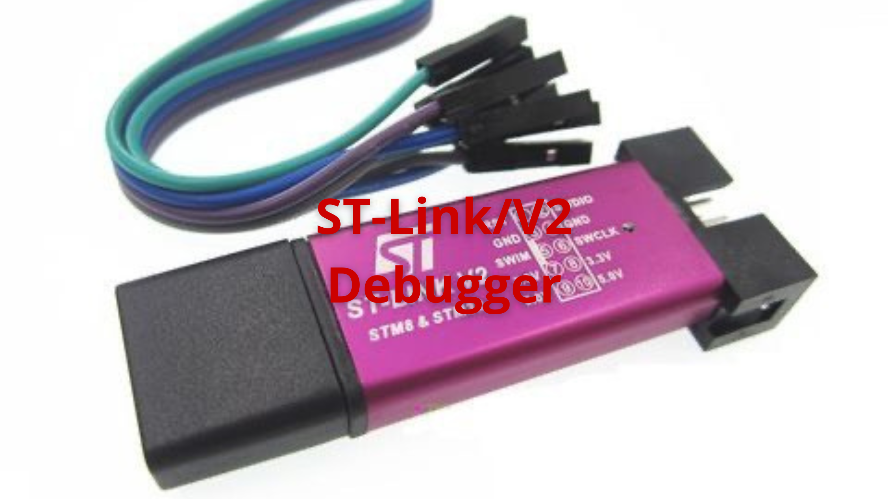

# Jet Station 🚀

# Menu

🏠 [Home](https://jet-station.github.io/) | 
🚀 [Embedded Systems](https://jet-station.github.io/embedded-systems/) |
🧰 [Development Toolbox](https://jet-station.github.io/development-toolbox/) |
🎓 [Training Courses](https://jet-station.github.io/training-courses/) |
📚 [Documents](https://jet-station.github.io/docs/)

# Development Boards

🎯 Development boards are essential for prototyping and building embedded systems. This section features popular boards used in the demo projects, highlights their key features, and offers guidance to help you choose the right hardware for your needs.

<!-- Images Placeholder -->

<!-- Add more images as needed -->

## Table of Contents
1. [STM32F103 Blue Pill Development Board](#stm32f103-blue-pill-development-board)
2. [Tiva C Series TM4C123G LaunchPad Evaluation Kit](#tiva-c-series-tm4c123g-launchpad-evaluation-kit)
3. [STM32F407 Discovery Development Kit](#stm32f407-discovery-development-kit)
4. [ST-Link Mini Debugger](#st-link-mini-debugger)
5. [ST-Link/V2 Debugger](#st-linkv2-debugger)
6. [Logic Analyzer](#logic-analyzer)

## STM32F103 Blue Pill Development Board

🚀 [STM32F103 Blue Pill Development Board](https://stm32-base.org/boards/STM32F103C8T6-Blue-Pill.html). 

<!-- Images Placeholder -->

<!-- Add more images as needed -->

🔑 **Key Features:**
- STM32F103C8T6 microcontroller (ARM Cortex-M3, 32-bit, up to 72 MHz)
- 64 KB Flash, 20 KB SRAM
- Multiple GPIOs, timers, ADCs, PWM, and communication interfaces (UART, SPI, I2C, USB)
- Low cost solution for embedded development, making it ideal for students, hobbyists, and anyone starting out with ARM microcontrollers.

✅ **Typical Use Cases:**
- Learning and experimenting with ARM Cortex-M3 architecture
- Developing and debugging real-time embedded applications
- Prototyping projects involving sensor integration, motor control, and USB communication

## Tiva C Series TM4C123G LaunchPad Evaluation Kit

🚀 [Tiva C Series TM4C123G LaunchPad Evaluation Kit - EK-TM4C123GXL](https://www.ti.com/tool/EK-TM4C123GXL)

<!-- Images Placeholder -->

<!-- Add more images as needed -->

🔑 **Key Features:**
- TM4C123G microcontroller (ARM Cortex-M4F, 32-bit, up to 80 MHz)
- 256 KB Flash, 32 KB SRAM
- On-board Stellaris ICDI for programming and debugging
- Multiple GPIOs, timers, ADCs, PWM, and communication interfaces (UART, SPI, I2C, USB)
- User LEDs and push-buttons for easy prototyping
- BoosterPack headers for hardware expansion

✅ **Typical Use Cases:**
- Learning and experimenting with ARM Cortex-M4F architecture
- Developing and debugging real-time embedded applications
- Prototyping projects involving motor control, sensor integration, and USB communication

## STM32F407 Discovery Development Kit

🚀 [STM32F407VG Discovery Development Kit](https://www.st.com/en/evaluation-tools/stm32f4discovery.html)

<!-- Images Placeholder -->

<!-- Add more images as needed -->

🔑 **Key Features:**
- STM32F407VG microcontroller with 1 MB Flash and 192 KB RAM
- On-board ST-LINK/V2 for programming and debugging
- Multiple GPIOs, timers, ADCs, DACs, and communication interfaces (USART, SPI, I2C, CAN, USB)
- Integrated audio DAC, MEMS microphone, and accelerometer for advanced applications
- User LEDs and push-buttons for easy prototyping
- USB OTG and microSD card support

✅ **Typical Use Cases:**
- Learning and experimenting with ARM Cortex-M4 architecture
- Developing and debugging real-time embedded applications
- Prototyping projects involving audio processing, sensor integration, and USB communication

## ST-Link Mini Debugger

🚀 [WeAct Studio's ST-Link Mini Debugger](https://github.com/WeActStudio/WeActStudio.MiniDebugger)

<!-- Images Placeholder -->

<!-- Add more images as needed -->

🔑 **Key Features:**
- Compact and affordable ST-Link V2 compatible debugger
- Supports programming and debugging STM32 and STM8 microcontrollers
- USB interface for easy connection to PC
- Compatible with popular IDEs such as STM32CubeIDE, Keil, and PlatformIO
- LED indicators for power and data status

✅ **Typical Use Cases:**
- Flashing firmware to STM32/STM8 microcontrollers
- Debugging embedded applications during development
- Ideal for hobbyists, students, and professionals needing a portable and reliable debugging tool

## ST-Link/V2 Debugger
🚀 [ST-Link/V2](https://www.st.com/en/development-tools/st-link-v2.html)

<!-- Images Placeholder -->

<!-- Add more images as needed -->

🔑 **Key Features:**
- Official STMicroelectronics debugger and programmer for STM8 and STM32 MCUs
- Supports SWD (Serial Wire Debug) and JTAG interfaces
- USB interface for easy connection to PC
- Compatible with STM32CubeIDE, Keil, IAR, and other popular IDEs
- Robust build quality and reliable performance

✅ **Typical Use Cases:**
- Programming and debugging STM32 and STM8 microcontrollers
- Developing and troubleshooting embedded applications
- Suitable for professional and educational use

💡 Another alternative is a lightweight and low-cost version of the ST-Link/V2 debugger for STM8 and STM32 microcontrollers, suitable for budget-conscious users and simple development needs.

<!-- Images Placeholder -->

<!-- Add more images as needed -->

## Logic Analyzer
🚀 Additionally, during testing and debugging, I use a logic analyzer to measure and capture the signals of microcontroller input/output pins. Logic analyzers are low cost and easy to use, making them ideal for quickly visualizing digital signals, troubleshooting communication protocols, and verifying timing in embedded projects.

<!-- Images Placeholder -->

<!-- Add more images as needed -->

# Repositories
🚀 [My Repositories](https://github.com/jet-station)

# Contact & Discussion
If you have any thing would like to discuss or cooperate with me, please don't hesitate to contact me via:
- 📧 Email [Ho Thien Ai](mailto:thienaiho95@gmail.com)
- 💼 LinkedIn [Thien Ai Ho](https://www.linkedin.com/in/thien-ai-ho/)

# Home Page
🏠 [Home](https://jet-station.github.io/)