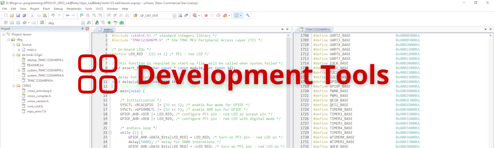
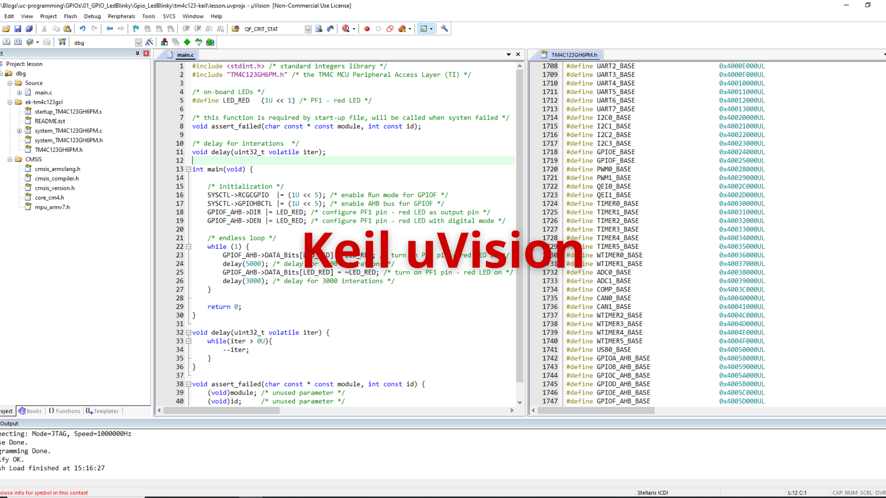
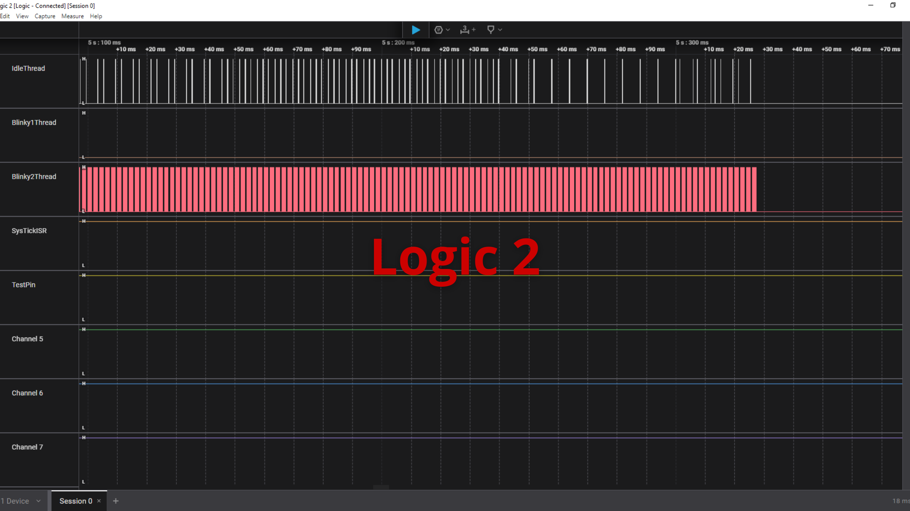

# Embedded System Labs 🚀

# Menu

🏠 [Home](https://embesyslabs.github.io/) | 
🚀 [Embedded Systems](https://embesyslabs.github.io/embedded-systems/) |
🧰 [Development Toolbox](https://embesyslabs.github.io/development-toolbox/) |
🎓 [Training Courses](https://embesyslabs.github.io/training-courses/) |
📚 [Documents](https://embesyslabs.github.io/docs/)

# Development Tools

🎯 Development tools are vital for creating, testing, and debugging embedded software. In this section, I discuss commonly used tools such as IDEs, compilers, and debuggers, along with those featured in the demo projects. These resources will help you set up an efficient workflow and tackle real-world embedded development challenges.

<!-- Images Placeholder -->

<!-- Add more images as needed -->

## Table of Contents
1. [Keil uVision IDE](#keil-uvision-ide)
2. [Logic 2](#logic-2)

## Keil uVision IDE
🚀 [Keil uVision IDE](https://www.keil.com/demo/eval/arm.htm). 

<!-- Images Placeholder -->

<!-- Add more images as needed -->

🔑 **Key Features:**
- Integrated development environment for ARM Cortex-M microcontrollers
- Powerful editor, compiler, and debugger in one tool
- Supports project management, code completion, and error checking
- Built-in flash programming and real-time debugging
- Extensive device support for STM32, NXP, TI, and more
- Free non-commercial version available for students and hobbyists

✅ **Typical Use Cases:**
- Writing, compiling, and debugging embedded C code
- Flashing firmware to ARM microcontrollers
- Learning and prototyping embedded applications

## Logic 2
🚀 [Logic 2](https://www.saleae.com/pages/downloads)

<!-- Images Placeholder -->

<!-- Add more images as needed -->

🔑 **Key Features:**
- Intuitive interface for visualizing and analyzing digital signals
- Supports a wide range of logic analyzers, including Saleae devices
- Protocol decoding for I2C, SPI, UART, CAN, and more
- Easy export and sharing of captured data
- Cross-platform support (Windows, macOS, Linux)

✅ **Typical Use Cases:**
- Debugging and analyzing microcontroller communication protocols
- Visualizing timing and signal integrity
- Troubleshooting embedded hardware and firmware issues

# Repositories
🚀 [My Repositories](https://github.com/embesyslabs)

# Contact & Discussion
If you have any thing would like to discuss or cooperate with me, please don't hesitate to contact me via:
- 📧 Email [Ho Thien Ai](mailto:thienaiho95@gmail.com)
- 💼 LinkedIn [Thien Ai Ho](https://www.linkedin.com/in/thien-ai-ho/)

# Home Page
🏠 [Home](https://embesyslabs.github.io/)